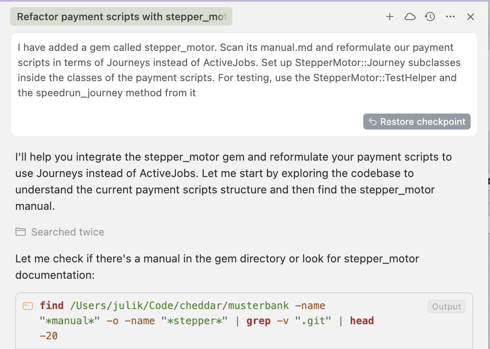

# Who am I?

Julik, previously WeTransfer, now Cheddar Payments. Engineering leadership and Ruby-centric for more than 2 decades.

------

Today I would like to talk to you about **stepper_motor,** which is my workflow engine for Rails.

^It originated at Cheddar, but is now used in other products as well.

------

We have a simple task: transfer money to a person using the Revolut REST API.

```ruby
class MoneyTransfer < ApplicationRecord
  def perform!
    client = RevolutClient.new
    result = client.transfer(amount:)
    update!(state: "done")
  end
end
```

------

But it will not necessarily succeed...

```ruby
class MoneyTransfer < ApplicationRecord
  def perform!
    client = RevolutClient.new
    result = client.transfer(amount:)
    if result.rejected?
      update!(state: "failed")
    elsif result.in_progress?
      update!(state: "in_progress")
    elsif result.ok?
      update!(state: "done")
    end
  end
end
```
----

And it needs to be idempotent...

```ruby
class MoneyTransfer < ApplicationRecord
  def perform!
    client = RevolutClient.new
    result = client.transfer(amount:, idempotency_key: Digest::SHA1.hexdigest(to_param))
    if result.rejected?
      update!(state: "failed")
    elsif result.in_progress?
      update!(state: "in_progress")
    elsif result.ok?
      update!(state: "done")
    end
  end
end
```
-----

And we need to poll if it takes a while...

```ruby
class MoneyTransfer < ApplicationRecord
  class Job < ApplicationJob
    def perform(transfer) = transfer.perform!
  end
 
  def perform!
    client = RevolutClient.new
    result = client.transfer(amount:, idempotency_key: Digest::SHA1.hexdigest(to_param))
    if result.rejected?
      update!(state: "failed")
    elsif result.in_progress?
      update!(state: "in_progress")
      MoneyTransferJob.set(wait: 30.seconds).perform_later(self)
    elsif result.ok?
      update!(state: "done")
    end
  end
end
```

----

And we need to rescue exceptions...

```ruby
def perform!
  client = RevolutClient.new
  result = client.transfer(amount:, idempotency_key: Digest::SHA1.hexdigest(to_param))
  if result.rejected?
    update!(state: "failed")
  elsif result.in_progress?
    update!(state: "in_progress")
    Job.set(wait: 30.seconds).perform_later(self)
  elsif result.ok?
    update!(state: "done")
  end
rescue => e
  Rails.error.report(e)
  Job.set(wait: 30.seconds).perform_later(self)
end
```

-----

But we also need to send emails...

```ruby
def perform!
  client = RevolutClient.new
  result = client.transfer(amount:, idempotency_key: Digest::SHA1.hexdigest(to_param))
  if result.rejected?
    update!(state: "failed")
    MoneyTransferMailer.transfer_failed(sender).deliver_later
  elsif result.in_progress?
    update!(state: "in_progress")
    Job.set(wait: 30.seconds).perform_later(self)
  elsif result.ok?
    update!(state: "done")
    MoneyTransferMailer.transfer_done(sender).deliver_later
    MoneyTransferMailer.transfer_received(recipient).deliver_later
  end
rescue => e
  Rails.error.report(e)
  Job.set(wait: 30.seconds).perform_later(self)
end
```

----

## And we didn't even get to

* Concurrency lock (a transfer can only be performing once)
* Row lock (multiple flows should not update `state` at the same time)
* Balance check before the transfer
* Balance adjustment after the transfer...


---

What we have here is an _implicit workflow._

## A workflow:

* A graph of _steps_ which are dependent on each other's completion or failure
* A step is imperative, the graph is declarative
* Steps branch into other steps or terminate the workflow

---

Why a graph? Here's why: all workflows are secretly DAGs (directed acyclic graphs). A ton of today's software uses DAGs and is built on them.

^* Your 3D engine resolves transforms on the leaf nodes first, then on their parent nodes, then  the scene transforms
* Your Terraform state is a capture of a DAG's resolution into values, and your Terraform configs are a declarative description of the DAG
* Most graphics packages today have the DAG - the objects, shaders, transforms and groups - as nodes in a DAG, and these nodes have attributes

---


^ This is the node graph underpinning a scene in Houdini, a sophisticated 3D animation and simulation system.

---


^ This is the node graph underpinning a script in Nuke, a highly complex compositing system for images. Images travel along those pipes.

---

## What flows along these pipes?

The edges of the DAG usually carry output downstream. But the fact that a node has executed (a sentinel) is also a value. Evaluating a node resolves it.

---

Most "workflow engines" are actually DAGs. Temporal:

```ruby
# Send an email every 30 days, for the year
class SleepForDaysWorkflow < Temporalio::Workflow::Definition
  def execute
    12.times do
      Temporalio::Workflow.execute_activity(
        SendEmailActivity,
        start_to_close_timeout: 10
      )

      Temporalio::Workflow.sleep(30 * 24 * 60 * 60)
    end
  end
end
```

---

is actually


---

is actually


---

...and `12.times` is part of it!


----

# acidic_job:

```ruby
class Job < ActiveJob::Base
  include AcidicJob::Workflow

  def perform(arg)
    @arg = arg

    execute_workflow(unique_by: @arg) do |w|
      w.step :step_1, transactional: true
      w.step :step_2
      w.step :step_3
    end
  end
end
```

---

...is actually 


---

When it came time to structure workflows in Cheddar, a question emerged: how important is it to have this:


---

...as opposed to a stack


---

Not that important, it turned out. A stack of steps performed in sequence is just a subset of a DAG.

---

These graph-based systems are always two-sided. There is the declarative side (the DAG definition) and the imperative side (the code that runs inside the nodes).

* Terraform: the DAG is HCL - your repo. The leaf nodes are the provider code (aws, gcp, azure) plugins
* Nuke - the DAG is TCL. The leaf nodes are native binary code

^DAGs get executed by resolving them using a topological sort. You trace dependencies of the nodes and start working through the nodes in order they are needed. But with a stack of steps there is an implicit step order you can follow to achieve the same effect - every step only has one dependency, its preceding step.

---

What we wanted from that workflow solution:

* No juggernaught-sized BS dependencies (Temporal, gRPC, Zookeeper, Kafka...)
* Durable state transitions for steps
* Uniqueness and identity out of the box

---

# ActiveJob is not a good abstraction

* acidic_job and ActiveJob::Continuation are both based on ActiveJob primitives, which are fine for fire-and-forget jobs...
* but are sorely lacking for workflows

---

# ActiveJob in identity crisis

```ruby
job = MyFabulousJob.perform_later(user)
job.id #=> What is this going to be, and where does it come from?

job = MyFabulousJob.new(user)
job.id #=> Will it be present?

MyFabulousJob.for_user(user).exists? #=> How do you do that with Sidekiq? With SQS?
```

^Active job does not define identity for jobs. It does not guarantee your job will get an ID, it does not guarantee the ID will be unique, and the ID gets assigned by the adapter and is implementation-defined.

---

...and it gets worse

```ruby
class MyFabulousJob < ApplicationJob
  retry_on StandardError #=> will the "id" be the same for the retry?
  # ...
end

class MyFabulousJob < ApplicationJob
  include JobIteration
  def build_enumerator(horizon, cutoff, cursor:)
    # ...
  end
  # What ID will MyFabulousJob have when it gets paused and re-enqueued?
end
```

^And worse: ActiveJob does not differentiate between a job ticket and a job execution session. One job, with one and the same ID, may stretch across several execution sessions due to retries. Or - if you are using job-iteration - across several iterations (with interruptions)

---

This is the fundamental issue with ActiveJob as abstraction for workflows.

* State is opaque (bag of attributes) and hard to DB-constrain
* Identity is murky (retries, iteration, re-enqueues for any reason)
* Querying is impossible with most adapters

----

What is the API that could work instead? Turns out, it was already invented: Heya.

```ruby
class OnboardingCampaign < ApplicationCampaign
  step :welcome, wait: 1.day, subject: "Welcome to my app!"
end
```

---
But repurposing Heya as a workflow engine didn't work:

* No method calls inside steps
* No access to identity
* No flow control from within steps

---

# What if we take the language of Heya and turn it into a workflow engine?

---

```ruby
class ReclaimJourney < StepperMotor::Journey
  cancel_if { !CashbackReclaimService.eligible?(hero) }

  step after: 1.hours do
    Notification::CashbackReclaim.deliver!(recipient: hero, expires_in_days: days_remaining)
    Analytics.track(user_id: hero.id, properties: {days_remaining:}, event: "Cashback Expiring Soon")
  end

  step after: 15.days do
    Notification::CashbackReclaim.deliver!(recipient: hero, expires_in_days: days_remaining)
    Analytics.track(user_id: hero.id, properties: {days_remaining:}, event: "Cashback Expiring Soon")
  end

  step after: 30.days do # Step delays balance out to 30 days
    ReclaimBalanceJob.perform_now(hero)
    Analytics.track(user_id: hero.id, event: "Cashback Expired")
  end

  def days_remaining
    time_remaining_until_final_step.in_days.floor
  end
end
```

---
# The `Journey` is actually an ActiveRecord

...with some single-table inheritance. A Journey has a Hero.

---
* The `hero` is a polymorphic association on the Journey
* Fitted with a stable identity (`find`, `where`)
* Fitted with stable uniqueness: `{hero_type,hero_id,type}`)

---

* Fitted with a durable state enum: `ready`, `performing` etc.)
* Gets row-locked during state transitions
* Can be associated to models

---

* ✔️ Association to a model
* ✔️ Identity
* ✔️ Uniqueness
* ✔️ Locks

---

📚 It is just an ActiveRecord 

```ruby
OnboardingJourney.for_hero(user) #=> OnboardingJourney...
OnboardingJourney.ready.count #=> 12

class User < ApplicationRecord
  belongs_to :onboarding_journey, optional: true, inverse_of: :hero
end
```

---
---

# Anonymous steps

```ruby
class PollStatusJourney < StepperMotor::Journey
  alias_method :payment, :hero

  step { verify_status! }

  # Then after 5 minutes
  step(wait: 5.minutes) { verify_status! }

  # Check every 2 hours after
  12.times do
    step(wait: 2.hours) { verify_status! }
  end

  # Check once a day after that
  7.times do
    step(wait: 1.day) { verify_status! }
  end

  step :terminate do
    payment.failed!
  end

  def verify_status!
    status = payment.current_status
    finished! if status.complete?
  end
end
```

---

## Calling your model methods

```ruby
class PollStatusJourney < StepperMotor::Journey
  delegate :initiate_transaction, :check_result, :notify_buyer, to: :hero
  step :initiate_transaction
  step :check_result
  step :notify_buyer
  step def additional_step
    Stats.increment("purchases", user_id: hero.user_id)
  end
end
```
---

# Scheduling

When a Journey starts, an ActiveJob gets enqueued that will perform the step on the Journey. The job is unique to that particular step execution (idempotency key) - retries won't make the step perform twice, and there will no concurrent executions either.

^In this case, ActiveJob is a scheduling aid - not the carrier of the logic nor identity nor state. That is important. It is "the finger that pulls the trigger" and nothing more than that.

---

# Lifecycle of a step

```ruby
journey = MyJourney.find(journey_id)
journey.perform_next_step(idempotency_key:)
   -> journey.with_lock { journey.update!(idempotency_key: new_ik, state: "performing) }`
   outcome = journey.method_named_same_as_step
   journey.act_according_to_outcome!(outcome)
end
```

---

# DB transactions

* When checking out a step (same as solid_queue/gouda)
* When scheduling a step
* ...and that's it!

---

Some things are still on you:

* Steps must be idempotent and it is your responsibility
* Structured rollback (sagas) is on you
* No suspension within a step / resumption within a step. Yet.

---

# But!

* No extra systems
* No extra data stores (no Redis, no Kafka, no RabbitMQ)
* No gRPC
* No bags-of-attributes
* Just use the database!

---

# Another example workflow

```ruby
# Journey to handle initial account setup after Google OAuth connection
#
# This journey orchestrates all the necessary steps to set up a new account:
# 1. Sync Gmail labels
# 2. Fetch important emails for fact extraction (perform_now)
# 3. Extract facts from emails (perform_later)
# 4. Fetch training emails for writing style
# 5. Generate writing style from training emails
# 6. Fetch historical emails
# 7. Generate email templates
# 8. Mark setup complete
#
# @example Start the journey after OAuth connection
#   AccountSetupJourney.create!(hero: account)
```
---

```ruby
class AccountSetupJourney < StepperMotor::Journey
  alias_method :account, :hero
  delegate :source_connected_account, to: :account
  cancel_if { !source_connected_account&.scopes_valid? }

  # Step 1: Sync Gmail labels
  step :sync_labels do
    SyncGmailLabelsJob.perform_later(source_connected_account)
  end

  # Step 2: Fetch important emails for fact extraction
  step :fetch_important_emails do
    broadcast_progress(0, "Starting email analysis...")
    result = FetchImportantEmailsService.new(account) do |progress, message|
      # Forward progress updates from the service
      broadcast_progress(progress, message)
    end.run
    cancel! unless result
  end

  # Step 3: Extract facts from emails
  step :extract_facts do
    skip! unless Flipper.enabled?(:onboarding_b, account.owner)
    # ...
  end
  # ...
end
```

---

# How do we transfer money?

```ruby
class TransferJourney < StepperMotor::Journey
  alias_method :transfer, :hero
  def client = RevolutClient.new

  step :initiate, on_exception: :reattempt! do
    result = client.transfer(amount: transfer.amount, idempotency_key: Digest::SHA1.hexdigest(to_param))
    transfer.update!(external_id: result.id, state: "in_progress")
  end

  step :poll, on_exception: :reattempt! do
    status = client.get_transfer(transfer.external_id)
    if status.ok?
      transfer.update!(state: "done")
    elsif status.in_progress?
      reattempt! wait: 5.seconds
    elsif status.rejected?
      transfer.update!(state: "failed")
    else
      logger.warn { "Unhandled Revolut state #{status.to_json}" }
      pause!
    end
  end

  step :notify do
    if transfer.done?
      MoneyTransferMailer.transfer_done(transfer.sender).deliver_later
      MoneyTransferMailer.transfer_received(transfer.recipient).deliver_later
    else
      MoneyTransferMailer.transfer_failed(transfer.sender).
deliver_later
    end
  end
end
```
---

# Machine, RTFM!

The manual works not only for humans.



^It turns out that to be effective with LLMs we need to turn back to what we used to care about: documentation. Developing with stepper_motor can be very effective given the following Cursor prompt

---

# Machine approves


^And it will even use a test helper we provide. speedrun_journey uses Rails tests' time travel to rapidly advance through your Journey and perform steps to completion (until the journey reaches a terminal state)


---

An LLM is much more effective if you communicate intent and desired style. Documentation, thus, not only the formal structure
(type definitions). Unlike IntelliSense or type checkers LLMs _are_ able to follow style guidance.

---

# And more!

Very soon: admin, visualisation, step records.

* Base version is free software
* Pro version will have the Admin UI
* Super version includes me in the package - helping you implement your journeys
* Next: parallel steps (fork and join)

---

# Already motoring at:


---

# Do give it a spin!

https://steppermotor.dev
https://x.com/juliknl


